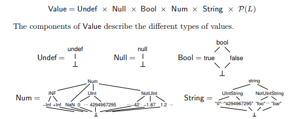

# Refinement.js

[TOC]

## 简介

Refinement.js 是 JavaScript 的一个契约式编程库，它利用 TAJS 等静态分析器作为后端，对 JavaScript 程序中出现的前置命题、后置命题和断言进行静态检查，寻找可能存在的 Bug。

项目地址: [refinement.js](https://github.com/NiceKingWei/refinement.js.git)

## 原理

将 JavaScript 代码中的 Specificaitons 编码为可以触发经典程序错误（如调用的函数为 null）的 JavaScript 代码，交给一个支持检查这类错误的程序分析器得到分析结果，最后将分析结果转化到原来的场景，得到分析报告。

编码辅助函数

```js
function __rfjs_null() {
	var ret = TAJS_newObject();
	ret.__rfjs_r = 0;
	return ret
}

function __rfjs_res(y) {
	TAJS_addContextSensitivity("y");
	var ret = TAJS_newObject();
	ret.__rfjs_r = function () {
		return y
	};
	return ret
}

function __rfjs_wrap() {
	function fun(x) {
		TAJS_addContextSensitivity("x");
		if (typeof x == "object" && x.__rfjs_r) {
			return x.__rfjs_r
		} else {
			return function () {
				return x
			}
		}
	}
	TAJS_makeContextSensitive(fun, 0);
	return fun
};
```

* __rfjs_null 和 __rfjs_res 返回同一种类型的对象，他们有唯一字段 __rfjs_r，用来包装函数返回的结果。__rfjs_null 的 __rfjs_r 字段值为 0，__rfjs_res 的 __rfjs_r 字段值为一个返回所包裹的值的函数。可以理解为 __rfjs_null 的类型是 Unit，而 __rfjs_res 的类型是 Unit->a。它们二者对外的接口是一致的。

* __rfjs_wrap 函数接收无限个数的参数，但并不读取它们，而是之间返回了一个函数 fun。函数 fun 接受一个参数 x，并判断 x 是否存在字段 __rfjs_r，如果存在，则说明 x 是 __rfjs_null 或 __rfjs_res 的返回值，于是 fun 之间输出 __rfjs_r 字段；如果不存在 __rfjs_r 字段，说明 x 是其他函数的返回值，则 fun 将它包装进 __rfjs_res，再按照 __rfjs_res 的方式输出。

* 对函数的编译如下：
    * 首先把函数分为三部分：前置命题、函数体和后置命题
    * 先判断前置命题是否满足，若不满足，返回 __rfjs_null
    * 然后将函数体放入闭包函数，通过调用该函数捕获返回值
    * 将后置命题应用到函数返回值上，若不满足，则原地触发 null() 错误；
    若后置命题满足，则返回 __rfjs_res(result)
    * 调用者收到返回值后，通过 __rfjs_wrap 解包，得到 0 或 function(){return result;}，执行它，则引发函数调用错误或得到真实返回值。
    * 若被调用的函数没有经过上述变换，则 __rfjs_wrap 解包得到 function(){return result;}，不会引发程序错误。通过这种方式，我们避开了对被调用函数的指向分析，使得编译过程不需要依赖控制流图。

* 敏感度的控制：
对于一个函数 fun，不同的地方对它的调用携带的上下文不同。不敏感的分析忽略这些不同，在分析时将它们都合并起来，得到一个整体的状态。这对于 specification 这种对精度要求比较高的分析来说是致命的。TAJS 提供了 TAJS_makeContextSensitive， TAJS_addContextSensitivity，TAJS_newObject 等内置函数来帮助分析器完成分析，程序员可以手动指定哪些函数、哪些参数、哪些变量是敏感的。在代码生成中，我们也用了这些函数来帮助我们得到更精确的分析结果。

## 未来的工作

* 更精确的分析和更友好的报错信息
* 允许对部分 specifications 进行动态检查（其实现在也可以，不过运行时检查失败会导致程序崩溃）

更有挑战性的工作（我对这部分更感兴趣）
* 可预测语义的抽象解释器
    * 上面的实验中，我们发现，只要程序分析器提供空指针异常的分析，我们就可以编码出对大部分 specifications 的分析。那么，是否能找到一个抽象的模型，使得抽象解释器只要实现了那些分析功能，我们就能通过编码来表达对其他约束的分析。
    * TAJS 提供的敏感度辅助函数的行为仍然很不可预测，我们是否能构造一个抽象解释器，使得我们的每一步操作，每一行代码都能有确定性的，可预测的，可解释的语义。

## 时间轴：研究经历

---------------------------

### xWIDL

* 传统的程序分析领域解决问题时大多不依赖 specifications，他们一般是根据自己设定的一些规则，在有限高度的单调半格框架下进行分析。例如动态语言的类型推断、活跃变量分析、不可达代码分析、内存泄露分析等等。


* 程序验证则是追求完备，先写出一些需要证明的命题，即程序满足的性质，如 fib(n) <= 2^n ，然后提供足够多的信息，协助 verifier 完成证明任务。对于 smt solver 那个体系的 verifer 来说，就是写一些 assertion, invariant, requires, ensures 等；对于 coq 来说，就是提供 tatics。总之，做程序验证对程序员要求很高。


* xWIDL 的出发点在于，跨语言库的提供者在提供 API 时可能会因为语言特性的不同或库神奇的设计架构而导致某些约束被隐藏了，例如论文中提到的隐式变量注册的问题。

    ```js
    var gl = document.getElementById("canvas").getContext("webgl");
    var buf = gl.createBuffer(); 
    /* WebGLBuffer object buf is registered in gl implicitly */
    /* now we get a different WebGL context gl2 from somewhere else */
    gl.bindBuffer(buf);  // Correct
    gl2.bindBuffer(buf); // Incorrect
    ```

    而有些约束并不像 “内存空间在用完后应该释放” 那么普遍，因而也很少有 analyzer 提供对这些约束的检测。verification 这边对性质的描述就非常灵活了，ensures, requires 可以随便写。所以我们可以用 assertion language 来描述这些隐藏的约束，再想办法求解它们。 xWIDL 利用了 verification 的方法去增强 analyzer 的功能，让程序员在不需要写 specification 的情况下得到一些反馈，这点我认为是非常好的，可以充分发挥 smt solver 强大的约束求解能力来扩展 analyzer 的分析内容。

* 我自己也尝试写过一些基于 smt solver 的验证，发现这是一件非常困难的事情，它几乎没有规律可循。毕竟 SAT 问题是 NP 问题，求解也只能是启发式地搜索，能不能搜索到完全看你给的搜索线索和运气（我曾经用 dafny 写过一个二叉搜索树，到现在我都还没想到怎样验证它的 delete 函数是满足性质：删除前中序遍历是升序 => 删除后中序遍历是升序）。对于基于 smt solver 的验证，现在似乎还没有完整的理论来指导怎么写 specificaitons，本质还是因为 smt solver 的求解算法对于使用者来说是黑盒。

* 对于 dafny 来说，如果你不写 specification，它在翻译的时候是会为你默认添加一点点信息的，但这点信息通常来说不够用，例如 rise4fun 上的一个例子

    ```c
    method m(n: nat)
    {
       var i: int := 0;
       while i < n
          invariant 0 <= i
       {
          i := i + 1;
       }
       assert i == n;
    }
    ```
    
    这个是不能通过验证的，要把 invariant 改为 `0 <= i <= n` 才可以

    ```c
    method m(n: nat)
    {
       var i: int := 0;
       while i < n
          invariant 0 <= i <= n
       {
          i := i + 1;
       }
       assert i == n;
    }
    ```

    这个程序是不存在 bug 的，但是因为上面的那段代码提供的信息不足，dafny 证不出来，所以被当成程序有 bug 了。

---------------------------------
### 与 xWIDL 和 Dafny 相关的实验

1. ​
```c++
class Buffer
{
}

class Context
{
    ghost var regs:set<Buffer>;

    method createBuffer() returns (bf:Buffer)
        modifies this
        ensures bf in regs
    {
        bf := new Buffer;
        regs := regs + {bf};
    }

    method bindBuffer(x:Buffer)
        requires x in regs
    {

    }
}


method m()
{
    var gl := new Context;
    var gl2 := new Context;
    var buf := gl.createBuffer();
    gl.bindBuffer(buf)
    gl2.bindBuffer(buf);
}
```
结果
```
test.dfy(31,18): Error BP5002: A precondition for this call might not hold.
test.dfy(18,19): Related location: This is the precondition that might not hold.
Execution trace:
    (0,0): anon0

Dafny program verifier finished with 5 verified, 1 error
```


2. ​
```c++
class Buffer
{
}

class Context
{
    ghost var regs:set<Buffer>;

    method createBuffer() returns (bf:Buffer)
        modifies this
        ensures bf in regs
    {
        bf := new Buffer;
        regs := regs + {bf};
    }

    method bindBuffer(x:Buffer)
        requires x in regs
    {

    }
}


method m()
{
    var gl := new Context;
    var gl2 := new Context;
    var buf := gl.createBuffer();
    assert (buf in gl.regs);
    assert (buf in gl2.regs);
    assert !(buf in gl2.regs);
}
```
结果
```
test.dfy(31,11): Error: assertion violation
Execution trace:
    (0,0): anon0
test.dfy(32,11): Error: assertion violation
Execution trace:
    (0,0): anon0
```
第一个例子成功发现了 bug。但从第二个例子可以看出，第一个例子之所以发现了 bug，是因为 verifier 对 gl2 的信息一无所知，它既不能证明 buf 在 gl2 中注册过，也不能证明 bug 没有在 gl2 中注册过。

另一个例子

3.
```c++
class Buffer
{
}

class Context
{
    ghost var regs:set<Buffer>;

    method createBuffer() returns (bf:Buffer)
        modifies this
        ensures bf in regs
    {
        bf := new Buffer;
        regs := regs + {bf};
    }

    method bindBuffer(x:Buffer)
        requires x in regs
    {

    }
}

method f(c:Context,b:Buffer)
    requires c!=null
{
    c.bindBuffer(b);
}

method m()
{
    var gl := new Context;
    var gl2 := new Context;
    var buf := gl.createBuffer();
    f(gl,buf);
}
```
结果
```
test.dfy(27,16): Error BP5002: A precondition for this call might not hold.
test.dfy(18,19): Related location: This is the precondition that might not hold.
Execution trace:
    (0,0): anon0
test.dfy(35,5): Error BP5002: A precondition for this call might not hold.
test.dfy(25,25): Related location: This is the precondition that might not hold.
Execution trace:
    (0,0): anon0

Dafny program verifier finished with 6 verified, 2 errors
```

这就是 dafny, boogie 等 verifier 的缺点了。为了降低验证时间，他们都是做模块化的验证，每个模块(function等)持有一个命题环境，出了这个模块，这些环境就丢失了，要通过 requires 显式传入其他模块，而 ensures 可以看作模块的输出。模块化的验证方法把“联系各个模块”的任务交给了程序员（例如在例3中，我们应该给 f 加上 requires 和 ensures，见例4）。对 xWIDL 来说，这个问题导致的结果就是我们很难做过程间分析，必须要在每一个过程都显式传递性质。

---------------------------

### 探寻新的验证/分析方案

* Gradual Refinement Types

    从 xWIDL 的出发点来看，很重要的一点是，怎样在程序员不写任何 specification 的情况下完成程序验证，这是非常困难的。我认为这是需要解决的核心问题。

    POPL'17 *Gradual Refinemet Types* 提出的 gradual refinement types 正是基于类似的想法：程序员只能提供不精确的 specification，或者甚至不愿意提供任何 specification，在这种情况下，我们怎么去完成程序验证。传统的 verifier (如 dafny) 设计的目标是验证程序是可信的、可靠的，因此大多对不精确的信息持悲观态度，例如一个函数 g(x) 需要它的参数大于0，如果程序员在调用时并没有证明参数满足前置条件，dafny 就会报错，拒绝这个函数调用。然而我们这里的需求不一样，我们要做的并不是验证整个系统可靠，我们要做的是尽可能多地发现 bug。换句话说，verification 要做的事情是发现可能的 bug，而 analyzer 要做的事情是证明存在 bug，如果还用 verification 的方法来做，结果就是“信息不足，证不出来” 被当做“存在 bug，证不出来”了。

* Design By Contract
  
    * Eiffel language
    
        契约式编程（在各个语言中都有类似的实现，例如 Javascript 中的 Contract.js）

    * Code Contract

        MSR 的程序分析器，针对 .NET 的 IR 进行分析，可以对 C#,VB.NET,F# 等语言进行分析，支持的 specifications 有 Requires, Ensures 和 Invariant。

* Program Analysis
  
    * Abstract Interpretation

        抽象解释，为程序中的变量选择抽象域，通过在控制流图上执行不动点算法来求得每个变量在特定时候的抽象值。

    * Symbolic Execution

        程序执行时不使用具体的值，而使用变量名等符号，常用于生存特定路径的测试用例。

----------------------

### 通过编码，将非平凡的分析问题转化为平凡的分析问题（如空指针异常）

常见的分析器大都只分析经典（平凡）错误，如空指针异常、内存泄漏、悬挂指针、数组越界等等，对于一些特定的问题如：隐式注册问题、文件关闭后使用等问题，分析器通常不提供分析。但是，我们发现，那些特定的问题和经典问题之间有很大的关联，例如文件关闭后再使用的问题就和内存释放后再使用的问题很相似。

因此，我们可以把特定的问题编码成经典的问题让程序分析器去分析，得到分析结果后再将它还原到特定的场景。

* 第一个例子
    ```javascript
    function Buffer(){

    }

    function GL(){
        this.createBuffer = function(){
            var bf = new Buffer();
            bf.ghost_gl = this;
            return bf;
        }
        
        this.bindBuffer = function(bf){

        }
    }

    function magic_function(obj){
        obj.magic = 1;
        return obj;
    }

    var gl = new GL();
    var gl2 = new GL();
    var bf = magic_function(gl.createBuffer());
    if(bf.ghost_gl==gl) gl.bindBuffer(bf); else undefined();
    if(bf.ghost_gl==gl2) gl2.bindBuffer(bf); else undefined();
    ```
    输出结果
    ```
    register.js: [definite] Ordinary program exit is unreachable
    register.js:26:47: [definite] TypeError, call to non-function
    register.js:25:1: [definite] The conditional expression is always true
    register.js:26:1: [definite] The conditional expression is always false
    register.js:18:5: [definite] Dead assignment, property magic is never read
    ```
    成功找出了 26 行处的 bug，并且指出了 25 行有 dead code

    用 dafny 来实现这个例子就需要写很多额外的 speicifications
    ```cpp
    class Buffer
    {
        ghost var ghost_gl:Context;
        ghost var magic:int;
    }

    class Context
    {
        method createBuffer() returns (bf:Buffer)
            ensures bf!=null && bf.ghost_gl == this
        {
            bf := new Buffer;
            bf.ghost_gl := this;
        }

        method bindBuffer(x:Buffer)
            requires x!=null && x.ghost_gl == this
        {

        }
    }

    method magic_function(bf:Buffer)
        requires bf != null
        ensures bf != null && bf.ghost_gl == old(bf).ghost_gl
        modifies bf
    {
        bf.magic := 1;
    }
    ```


    method m()
    {
        var gl := new Context;
        var gl2 := new Context;
        var buf := gl.createBuffer();
        magic_function(buf);
        gl.bindBuffer(buf);
        gl2.bindBuffer(buf);
    }
    ```
    上述代码输出的结果是
    ```
    Dafny program verifier version 1.9.7.30401, Copyright (c) 2003-2016, Microsoft.
    register.dfy(38,17): Error BP5002: A precondition for this call might not hold.
    register.dfy(17,39): Related location: This is the precondition that might not hold.
    Execution trace:
        (0,0): anon0
    register.dfy(39,18): Error BP5002: A precondition for this call might not hold.
    register.dfy(17,39): Related location: This is the precondition that might not hold.
    Execution trace:
        (0,0): anon0
    
    Dafny program verifier finished with 7 verified, 2 errors
    ```
    找到了一个 bug，但有一个误报。只有注释掉 magic_function 才能达到 TAJS 的分析效果。
    ```
    Dafny program verifier version 1.9.7.30401, Copyright (c) 2003-2016, Microsoft.
    register.dfy(39,18): Error BP5002: A precondition for this call might not hold.
    register.dfy(17,39): Related location: This is the precondition that might not hold.
    Execution trace:
        (0,0): anon0
    
    Dafny program verifier finished with 7 verified, 1 error
    ```
    对于 Platform API，我们可以为它写一些 specifications，但是像 magic_function 这样的用户函数，是不可能每个都写上 specifications 的，用户不可能写，代码生成器也很难生成出满足 verifier 需求的specifications。
    
    其实从两种方法的原理上来看，verification 用的是 smt solver，一个求解约束的黑盒工具。因为 smt solver 要保证通用性，它对很多东西的建模都是很数学、很形式化的（例如对实数的建模，就不局限与 float 或 double）。这会导致它在求解时状态空间变大，使得求解结果变得不尽如人意。抽象解释就打破了这层封装，直接对语言的类型进行建模，并精心挑选合适的抽象域以权衡精度和效率。
    这个图是从 SAS'09 Type Analysis for JavaScript 上截的
    
    可以看到，抽象解释在针对特定问题时进行的建模是非常实际的，很多针对特定语言特性的优化也是容易做的，不像 smt solver，所有的 verification conditions 都要翻译成 smt-lib2，再交给 smt solver 求解。
    
    TAJS 还做了很多关于 js 的特定的工作，例如对 prototype 的建模等等，这些工作牺牲了通用性（在其他语言上用不了），但换来了效率和精度的提升。所以用抽象解释的方法来做specification 的验证是合适的，可扩展性也很好，我只需要输出经过以下变换的 js 代码，交给任何一个支持检查 null safety 的 analyzer 就可以得到反馈了。
    ```javascript
    if(precondition){
        var result = (function(){
            do_something();            
            if(!assert_condition) undefined();
        })();
        if(!postcondition) undefined();
    } else {
        undefined();
    }
    ```

* 第二个例子
    ```javascript
    function Blob(){
        this.ghost_available = function(x){return x;};
        
        this.close = function(){
            this.ghost_available = null;
        }
    }

    function createObjectURL(blob){
        
    }

    var blob = new Blob();
    blob.ghost_available(createObjectURL)(blob);
    var blob_alias = blob;
    blob_alias.close();
    blob.ghost_available(createObjectURL)(blob);
    ```
    输出结果
    ```
    open.js: [definite] Ordinary program exit is unreachable
    open.js:17:1: [definite] TypeError, call to non-function
    open.js:17:1: [definite] Property is null/undefined
    ```
    同样找出了 bug ，并且没有误报

--------------------------------

### 通用的编码方式

上述编码方式比较随意，在代码生成的真实场景中，依赖抽象语法树得到的信息不足以完成上述编码。例如：对于 x.fun，仅仅根据抽象语法树，既不能知道 x 的类型，也不能找到 fun 的定义。如果我们让空指针错误在被调用函数 fun 内部触发，那么程序分析器只能告诉我们 fun 的某一行出现了空指针错误，但不能回溯出具体是哪里的调用导致了这个错误。

因此，我们需要更具有技巧性的，更通用的编码方式。具体实验如下：

* rfjs 编译源代码产生目标 js 代码，将 specifications 转化为动态检查代码。下例中的 sqrt_ 为源代码，sqrt 为目标代码。

```javascript
function sqrt_(x){
	requires(x>=0);
	ensures(function(res){return res>=0;});
	var result = Math.sqrt(x);
	assert(result>0);
	return result;
}

function ViolationError(){}

function sqrt(x) {
	if(!(x>=0)) return undefined;						// precondition
	var result = function(){
		var result = Math.sqrt(x);
		if(!(result>0)) {undefined();}					// assert
		return result;
	}();
	if(!(function(res){return res>=0;})(result)) return undefined;	// postcondition
	return function(){return result};
}

sqrt(4)();
sqrt(-1)();
sqrt(0)();
```

* 问题：我们对 sqrt_ 进行了变换，得到了 sqrt，于是函数调用从 sqrt_(4) 变成了sqrt(4)()，但我们 ViolationError 并没有经过这样的变换，因此我们调用时不应该再执行一遍返回的结果。

* 解决方案：用一个 wrap 函数对结果进行包装，通过标志位判断是否是经过经过变换的函数返回的结果。

```javascript
function __rfjs_res(y){
	this.__rfjs_r = (y==null)?0:function(){return y;};
}
function __rfjs_wrap(x){
	if(x!=null){
		if(x instanceof __rfjs_res){
			return x.__rfjs_r;
		}else{
			return function(){return x}
		}
	}else{
		return function(){return x}
	};
}
function __rfjs_null(){return new __rfjs_res();}
__rfjs_wrap(new __rfjs_res(0));
__rfjs_wrap(null);
new __rfjs_res(null);
```

所有函数调用全包上一层 `__rfjs_wrap`。
如 `sqrt(x)` 变为 `__rfjs_wrap(sqrt(x))()`

对函数的编译如下
```javascript
function sqrt {
    if(!(x>=0)) return __rfjs_null();	                        // precondition
	var r = (function(){
		var result = Math.sqrt(x);
		(function(){if(!(result>0)) {null();}})();		// assert
		return result;
	})();
	if(!(function(res){return res>=0;})(r)) return __rfjs_null();	// postcondition
	return new __rfjs_res(r);
}
```

* 问题：多层函数嵌套导致分析结果不精确

* 解决方案：通过 TAJS 的内置函数，指导 TAJS 调整敏感度。

## 参考文献


1. Zhang, Zhen. "xWIDL: modular and deep JavaScript API misuses checking based on extended WebIDL." Companion Proceedings of the 2016 ACM SIGPLAN International Conference on Systems, Programming, Languages and Applications: Software for Humanity. ACM, 2016.
1. Jensen, Simon Holm, Anders Møller, and Peter Thiemann. "Type analysis for JavaScript." International Static Analysis Symposium. Springer, Berlin, Heidelberg, 2009.
1. Kashyap, Vineeth, et al. "Type refinement for static analysis of JavaScript." ACM SIGPLAN Notices. Vol. 49. No. 2. ACM, 2013.
1. Jensen, Simon Holm, Anders Møller, and Peter Thiemann. "Interprocedural analysis with lazy propagation." International Static Analysis Symposium. Springer, Berlin, Heidelberg, 2010.
1. Andreasen, Esben, et al. "Improving Tools for JavaScript Programmers." Proc. of International Workshop on Scripts to Programs. Beijing, China:[sn]. 2012.
2. Laviron, Vincent, and Francesco Logozzo. "Refining abstract interpretation-based static analyses with hints." Asian Symposium on Programming Languages and Systems. Springer, Berlin, Heidelberg, 2009.
1. Lehmann, Nico, and Éric Tanter. "Gradual refinement types." ACM SIGPLAN Notices 52.1 (2017): 775-788.
1. Fähndrich, Manuel, and Francesco Logozzo. "Static contract checking with abstract interpretation." International Conference on Formal Verification of Object-Oriented Software. Springer, Berlin, Heidelberg, 2010.
1. Ferrara, Pietro, Francesco Logozzo, and Manuel Fähndrich. "Safer unsafe code for. net." ACM Sigplan Notices 43.10 (2008): 329-346.
1. Cousot, Patrick M., et al. "An abstract interpretation framework for refactoring with application to extract methods with contracts." ACM SIGPLAN Notices. Vol. 47. No. 10. ACM, 2012.
1. Logozzo, Francesco. "Technology for inferring contracts from code." ACM SIGAda Ada Letters. Vol. 33. No. 3. ACM, 2013.