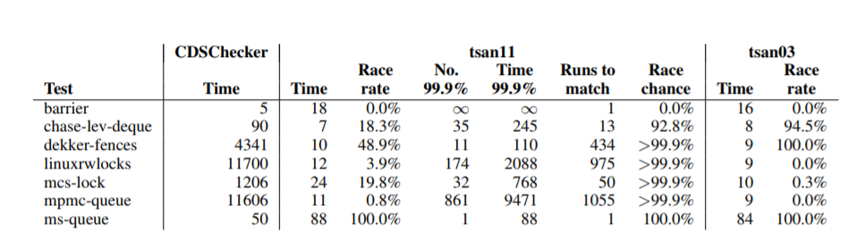
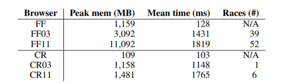

# Dynamic Race Detection for C++11

## Introduction

The definition of a data race in C++11 is far from trivial, due to the complex rules for when synchronisation occurs between the various atomic operations provided by the language, and memory order with which atomic operations are annotated.

The current state-of-art in dynamic race detection is ThreadSanitizer(tsan).Although the tool can be applied to programs that use C++11 concurrency, the tool does not understand the specifics of the C++11 memory model. The paper tries to modify the asan tool to be fully aware of the memory model.

## Background

Before we talk about details in the paper, let's have an overview of C++11 concurrency and the vector clock algorithm for data race detection and ThreadSanitizer

### C/C++11 Memory Model

The C/C++11 standards provide several low level atomic operations on atomic types, and memory orderings attached to them. Memory orderings specify how regular, non-atomic memory accesses are to be ordered around an atomic operation. There are four atomic operations:  stores, loads, read-modify-writes(**RMW**s) and fences, and six memory orderings: relaxed, release, acquire consume, release-acquire, sequentially-consistent. The RMWs will modify the existing value of an atomic location, storing the new value and returning the previous value atomically. Fences decouple the memory ordering constraints mentioned bellow from atomic location, allowing for finer control over synchronization. A *load* is an atomic load or RMW.An *acquire load* is a load with acquire, acquire-release or sequentially consistent ordering. A *store* is an atomic store or RMW. A *release store* is a store with release, acquire-release or sequentially consistent ordering.

The model is defined using a set of relations and predicates. Here is an overview.

We use **W**, **R**, **RMW** and **F** to represent read, write, RMW and fence. Memory orderings are
shortened to **rlx**, **rel**, **acq**, **ra**, **sc** and **na** for relaxed, release, acquire, release-acquire, sequentially-consistent and non-atomic, respectively. For example, $\text{a:W}_{\text{rel}}\text{x=1}$ is a memory event that corresponds to a relaxed write of 1 to memory location **x**; **a** is a unique identifier for the event. and, $\text{b:RMW}_{\text{ra}}x=1/2$ shows event b reading value 1 from and writing value 2 to **x** and writing value 2 to **x** atomically. Fences have no associated values and atomic locations.

Now, we can define relations that help us define the guarantees the C++11 memory model gives us. 

#### Pre-executions

* *sequenced-before (sb)* : an intra-thread relation that orders events by the order they appear in the program. Operations within an expression are ordered, so *sb* is not total within a thread
* *additional-synchronises-with (asw)*: cause synchronization on thread launch and join

The events, *sb* and *asw* form a *pre-execution*.

#### Witness Relations

A single pre-execution, disregarding the event values, can give rise to many different executions, depending on the behaviors the program can exhibit. A pre-execution combined with a set of relations characterizing the behavior of a particular execution is referred to as a *candidate execution*.

* *reads-from (rf)*: show which store each load reads from. for a store $a$ and load $b$, $(a,b)\in rf$ indicates that the value read by $b$ was written by $a$. In any execution, there are usually many stores that a load can read from.
* *modification-order (mo)*: a total order over all of the stores to a single atomic location.
* *sequentially-consistent (sc)*: a total order over all atomic operations in the execution marked with sequentially-consistent ordering.

The candidate set of executions is the set of pre-executions extend with the witness relations.

#### Derived Relations

Given a pre-execution and witness relations, a further set of relations can be derived that will allow us to see whether said execution follows the rules set out by the memory model.

* *release-sequence (rs)*: represent a continuous subset of the modification order. It is headed by a release store, and continues along all stores to the same location. The *rs* is *blocked* when another thread performs a store to the location. A **RMW** from another thread will however continue the *rs*.
* *hypothetical-release-sequence (hrs)*: works the same way as a release sequence, but is headed by both release stores and non-release stores.
* *synchronizes-with (sw)*: define the points in an execution where one thread has synchronized with another. When a thread performs an acquire load, and reads from a store that is part of a release sequence, the head of the release sequence synchronizes with the acquire load.   Acquire fences will synchronize if a load sequenced before the fence reads from a store that is part of a release sequence. Release fences use the hypothetical release sequence. A release fence will synchronize if an acquire load reads from a hypothetical release sequence that is headed by a store sequenced after the fence. Release fences and acquire fences can also synchronize with each other. An *asw* edge is also a *sw* edge
* *happens-before(hb)*: defined as $(sb\cup sw)^+$ , representing Lamport's partial ordering over the events in a system.

#### Data Races

Now that we have defined the happens-before relation, we can give a formal definition of a *data race*, as described by the C/C++11 standard. A data race occurs between two memory accesses when at least one is non-atomic, at least one is a store, and neither happens before the other according to the *hb* relation.

#### Consistent Executions

The C++11 memory model is axiomatic -- it provides a set of axioms that an execution must abide by in order to be exhibited by a program. A candidate execution that conforms to such axioms is said to be consistent. Inconsistent executions are discarded, as they should never occur when the program ins compiled and executed. If any consistent execution is shown to have a data race, then the set of allowed execution is shown to have a data race, then the set of allowed executions is empty, leaving the program undefined.

### Dynamic Race Detection

A dynamic race detector aims to catch data races while a program executes. This requires inferring various properties of the program after specific instruction have been carried out.

 The vector clock (VC) algorithm is a prominent method for race detection that can be applied to multiple languages. It aims to precisely compute the happens-before relation. Each thread in the program has an *epoch* representing its current logical time. A VC holds an epoch for each thread, and each thread has its own VC, denoted $\mathbb{C}_t$ for thread $t$. Each epoch in $\mathbb{C}_t$ represents the logical time of the last instruction by the corresponding thread that happens before any instruction thread $t$ will perform in the future. Now we define operators for VC: $\bot V=\lambda t.0$, $V_1\cup V_2\triangleq\lambda t.\text{max}(V_1(t), V_2(t))$, $V_1\leq V_2\triangleq\forall t.V_1(t)\leq V_2(t)$, $inc_t(V)=\lambda u. \texttt{if}\ u = t\ \texttt{then}\ V(u) + 1\ \texttt{else}\ V(u)$. Upon creation of thread t, $\mathbb{C}_t$ is initialized to $inc_t(\bot V )$ . Each atomic location $m$ has its own VC, $\mathbb{L}_m$, that is updated as follows: when thread t performs a release operation on m, it releases Ct to m: $\mathbb{L}_m$ := $\mathbb{C}_t$. When thread $t$ performs an acquire operation on $m$, it acquires $\mathbb{L}_m$ using the join operator: $\mathbb{C}_t$ := $\mathbb{C}_t$ ∪ $\mathbb{L}_m$. Thread $t$ releasing to location m and the subsequent acquire of $m$ by thread $u$ simulates synchronization between $t$ and $u$. On performing a release operation, thread t’s vector clock is incremented: $\mathbb{C}_t$ := inct($\mathbb{C}_t$). 

To detect data races, we must check that certain accesses to each location are ordered by *hb*, the happens-before relation. As all writes must be totally ordered, only the epoch of the last write to a location $x$ needs to be known at any point, denoted $Wx$. As data races do not occur between reads, they do not need to be totally ordered, and so the epoch of the last read by each thread may need to be known. A full VC must therefore be used to track reads for each memory location, denoted $\mathbb{R}_x$ for location $x$; $\mathbb{R}_x (t)$ gets set to the epoch $\mathbb{C}_t(t)$ when $t$ reads from $x$. To check for races, a different check must be performed depending on the type of the current and previous accesses. These are outlined as follows, where thread $u$ is accessing location $x$, c@t is the epoch of the last write to $x$ and $\mathbb{R}_x$ represents the latest read for $x$ by each thread; if any check fails then there is a race: 

* **write-write**: $c\leq\mathbb{C}_u(t)$
* **write-read**: $c\leq\mathbb{C}_u(t)$
* **read-write**: $c\leq\mathbb{C}_u(t)\wedge\mathbb{R}_x\leq\mathbb{C}_u$

#### ThreadSanitizer

ThreadSanitizer (tsan) is an efficient dynamic race detector tool aimed at C++ programs. he tool originally targeted C++03 programs using platform-specific libraries for threading and concurrency, such as pthreads. The tool was designed to support C++11 atomic operations, but does not fully capture the semantics of the C++11 memory model when tracking the happens-before relation. This imprecision was motivated by needing the tool to work on large legacy programs, for which performance and memory consumption are important concerns, and the tsan developers focused on optimizing for the common case of release/acquire synchronization. 

#### Limitations of tsan

tsan cannot identify blocked release sequences, which creates an over-approximation of the happens-before relation. On the other hand, tsan does not recognize fence semantics and their role in synchronization, causing tsan to under-approximate the happens-before relation and produce false positives. 

## Data Race Detection for C++11

The traditional VC algorithm ,  is defined over simple release and acquire operations, and is unaware of the more complicated synchronization patterns of C++11. The paper updates the VC algorithm to properly handles C++11 Synchronization. 

### Release Sequences

To adapt the VC algorithm to correctly handle the blocking of release sequences, we store for each location $m$ the id of the thread that performed the last release store to $m$. Let $\mathbb{T}_m$ record this thread id. When a thread with id $t$ performs a release store to $m$, the contents of the VC for $m$ are over-written: $\mathbb{L}_m$ := $\mathbb{C}_t$, and $t$ is recorded as the last thread to have released to $m$: $\mathbb{T}_m$ := $t$. This records that t has started a release sequence on $m$. Now, if a thread with id $u  \neq \mathbb{T}_m$ performs a relaxed store to $m$, the VC for $m$ is cleared.

RMWs provide an exception to the blocking rule: an RMW on location $m$ does not block an existing release sequence on $m$. Each RMW on $m$ with release ordering starts a new release sequence on $m$,	 meaning that an event can be part of multiple release sequences. If a thread $t$ that started $a$ release sequence on $m$ performs a non-RMW store to $m$, the set of currently active release sequences for $m$ collapses to just the one started by $t$. 

To represent multiple release sequences on a location m, we make $\mathbb{L}_m$ join with the VC for each thread that starts a release sequence. An acquiring thread will effectively acquire all of the VCs that released to $\mathbb{L}_m$ when it acquires $\mathbb{L}_m$. This is not enough however. Consider the case of collapsing release sequences when a thread t that started a release sequence on m performs a relaxed non-RMW store. We require the ability to replace $\mathbb{L}_m$ with the VC that t held when it started its release sequence on m, but this information is lost if t’s VC has been updated since it performed the original release store. To preserve this information, we introduce for each location $m$ a vector of vector clocks (VVC), $\mathbb{V}_m$, that stores the VC for each thread that has started a release sequence on $m$. How $\mathbb{V}_m$ is updated depends on the type of operation being performed. If thread t performs a non-RMW store to m, $\mathbb{V}_m(u)$ is set to $\bot_V$ for each thread $u\neq t$. If the store has release ordering, $\mathbb{V}_m(t)$ and $\mathbb{L}_m$ are set to $\mathbb{C}_t$; as a result, t is the only thread for which there is a release sequence on m. If instead the store has relaxed ordering, $\mathbb{V}_m$(t) is left unchanged, and $\mathbb{L}_m$ is set to $\mathbb{V}_m(t)$. 

### Fences

A fence is an atomic operation that does not work on any particular location. It is annotated with a memory ordering like other atomic operations, and thus can be a release fence and/or acquire fence. Fences with SC ordering have special meaning.  As discussed above, fences are not handled by tsan. In order to allow the VC algorithm to handle fence synchronization, the VC from whence a thread performed a release fence must be known.For each thread $t$ we introduce two new VCs to track this information: the fence release clock, $F_{rel}^t$ , and the fence acquire clock, $F_{acq}^t$ . We then extend the VC algorithm as follows. When thread $t$ performs a release fence, $F_{rel}^t$ is set to $\mathbb{C}_t$; when $t$ performs an acquire fence, $F_{acq}^t$ is joined on to the thread’s clock. When a thread $t$ performs a relaxed store to $m$, $F_{rel}^t$ is joined on to $\mathbb{L}_m$. If $t$ performs a relaxed load from $m$, $\mathbb{L}_m$ is joined on to $F_{acq}^t$ . 

## Exploring Weak Behaviors

The fact that the C++11 memory model allows non-SC behaviors poses a problem for data race detection techniques: a tool such as tsan that only considers SC executions will not be able to explore these additional behaviors.

The paper gives a design that can enable exploration of a large fragment of the non-SC executions allowed by C++11. The essential idea is as follows: every atomic store is intercepted, and information relating to the store is recorded in a store buffer. Every atomic load is also intercepted, and the *store buffer* is queried to determine the set of possible stores that the load may acceptably read from. 

### Post-Store Buffering

Consider the case where a thread performs an atomic store to an atomic location. Depending on the state of the thread and the memory order used, atomic loads should be able to read from this store, even if there has been an intervening store to the same location. We will therefore record the atomic stores to each location in a buffer, allowing the instrumentation library to search though and pick a valid store to read from. 

On intercepting a store to location $m$, the VC updates are performed, to facilitate race checking. The value to be stored to $m$ is then placed in the store buffer for $m$. Each individual store in the store buffer is referred to as a *store element*, and contains a snapshot of the state of the location at the time the store was performed. This snapshot includes the meta-data required to ensure that each load can be certain that reading from the store will lead to a consistent execution. 

### Coherence rules

In C++11 memory model, there are four coherence rules:

* **Coherence of write-write**(**CoWW**): Synchronization follows the *rf* relation (and *sb* when fences are involved), and as a load can only read from a store already in the store buffer, *mo* must conform with *rf* .
* **Coherence of write-read**(**CoWR**): a load cannot read from a store if there is another store later in *mo* such that said store happens before the current load. 
* **Coherence of read-write**(**CoRW**): a load cannot read from a store if there is another store earlier in *mo* that happens after the current load. 
* **Coherence of read-read**(**CoRR**):  t if two reads from the same location are ordered by *hb*, the reads cannot observe writes ordered differently in *mo*

It can be proved that **CoWW** holds in the formalization. 

The instrumentation library automatically conforms to **CoRW**. This is because violating **CoRW** would require a thread to read from a store that has not yet been added to the store buffer for a location, something our instrumentation does not allow. This is illustrated by the execution fragment shown for **CoRW** above. This reasoning also assumes that we follow the *hb* relation. 

For **CoWR**, each store element must record sufficient information to allow a thread issuing a load to determine whether the store happened before the load. To enable this, the id of the storing thread must be recorded when a store element is created, together with the epoch associated with the thread when the store was issued. When a load is issued, the instrumentation library can then search the store buffer to find the latest store in *mo* that happened before the current load; all stores prior to the identified store are cut off from the perspective of the loading thread. This is achieved by searching the buffer backwards, from the most recent store. For a given store element, let $c@t$ be the epoch of the thread that performed the store. With C denoting the VC of the loading thread, if $c\leq\mathbb{C}_t$ then the store will happen before the load, so we halt the search.    

To ensure **CoRR**, it is thus necessary for a thread to be aware of loads performed by other threads. To handle this, we equip our instrumentation library with software load buffers as follows. We augment every store element with a list of *load elements*. When a thread reads from a store element, a new load element is created and added to the list of load elements associated with said store element. Each load element records the id of the thread that issued the load, and the epoch associated with the thread when the load was issued. Whenever our instrumentation library is searching through the store buffer for the earliest store that a load is allowed to read from, it must also search through all the load elements associated with each store element. For a load element under consideration, let $c@t$ be the epoch of the thread that carried out the load, and $\mathbb{C}$ the VC of the thread that is currently performing a load. If $c\leq\mathbb{C}_t$, then the load associated with the load element happened before the current load, and we must halt the search.    

### Sequential Consistent Fences

SC fences also add a layer of complexity to what the memory model allows. An SC fence will interact with other SC fences and reads in a number of ways:

1. $W_{non-SC}\stackrel{sb}{\rightarrow}F_{sc}\stackrel{sc, inter}{\longrightarrow}R_{SC}$: The SC read must read from the last write sequenced before the SC fence, or any write later in modification order. Non-SC reads are unaffected. 
2. $W_{SC}\stackrel{sc, inter}{\longrightarrow}F_{sc}\stackrel{sb}{\rightarrow}R_{non-SC}$: The non-SC read must read from the SC write, or a write later in modification order. If there is no SC write, then the read is unaffected. 
3. $W_{non-SC}\stackrel{sb}{\rightarrow}F_{sc}\stackrel{sc, inter}{\longrightarrow}F_{sc}\stackrel{sb}{\rightarrow}R_{SC}$: Any read sequenced after the SC fence must read from the last write sequenced before the SC fence, or a write later in modification order.
4. $W_SC;R_SC$: The SC read must read from the last SC write, a write later in *mo* than the last SC write, or a non-SC write that does not happen before some SC write to the same location. 

Accommodating SC fences in our instrumentation library is not trivial, requiring additional VCs and VC manipulation on every SC operation. We begin by defining two global VCs: $\mathbb{S}_F$ , representing the epoch of the last SC fence performed by each thread, and $\mathbb{S}_W$ , the epoch of the last SC write performed by each thread. Each thread will update its position in these VCs whenever they perform an SC fence or SC write    

Each thread t now has an extra three VCs: $\$_{F,t}$, $\$_{W,t}$ and $\$_{R,t}$. Each VC will control each of the three cases outlined above. These are updated when the thread performs an SC operation. When a thread performs an SC fence, it will acquire the two global SC VCs: $\$_{F,t} :=  \$_{F,t}\cup \mathbb{S}_F$and  $\$_{W,t} :=  \$_{W,t}\cup \mathbb{S}_W$ . When a thread performs an SC read, it will acquire the global SC fence VC in the following way:  $\$_{R,t} :=  \$_{R,t}\cup \mathbb{S}_F$. To see how this enforces the rules outlined above, consider a thread t that is performing an atomic load on location x. While searching back through the buffer, we have reached a store performed by thread u at epoch c@u. If the load is an SC load, and $\$_{R,t}(u) \geq c$, then we halt the search according to (1). If the store is an SC store, and $\$_{W,t}(u) ≥ c$, then we halt the search according to (2). Regardless of whether the load or the store is SC, if $\$_{F,t}(u) \geq c$ then (3) applies. To handle (4), each store element must be marked with a flag indicating whether it was an SC store. Additionally, every store element that happens before the current store must also be marked as a SC store. When an SC load has searched back through the buffer and found the earliest feasible store to read from, it may read from any store element that is unmarked, or the last marked element.    

## Implementations and Evaluations

The authors compare the extended tsan(tsan11) with original tsan(tsan03) and CDSChecker. They run comparison tests on 7 benchmarks. The result is as follows:

the percentage of runs that exposed races (**Race rate**), the number of runs required for a data race to be detected with at least 99.9% probability based on the race rate (**No. 99.9%**), and the associated time to conduct this number of runs, based on the average time per run (**Time 99.9%**). The **Runs to match** column shows the number of runs of tsan11 that could be performed in the same time as CDSChecker takes to execute (rounded up), and **Race chance** uses this number and the race rate to estimate the chances that tsan11 would find a race if executed for the same time that CDSChecker takes for exhaustive exploration .

We can draw from the results that tsan11 performs better than tsan03 in race detection. And it outperforms CDSChecker in time to detect races.

They also runs it on large applications, i.e. Chrome and Firefox.

**FF** means running with original Firefox, **FF03** means running with tsan03, **FF11** means running with tsan11. The same for **CR**, which stands for Chromium. Though tsan11 detect more races than tsan03, it puts a huge overhead to programs.

## Conclusion

The paper has presented a method for accurate dynamic race analysis for C++11 programs, and an instrumentation library that allows a large fragment of the C++11 relaxed memory model to be explored. Their experiments show that their implementation, an extension to tsan, can detect races that are beyond the scope of the original tool, and that their extended instrumentation still enables analysis of large applications—the Firefox and Chromium web browsers 

